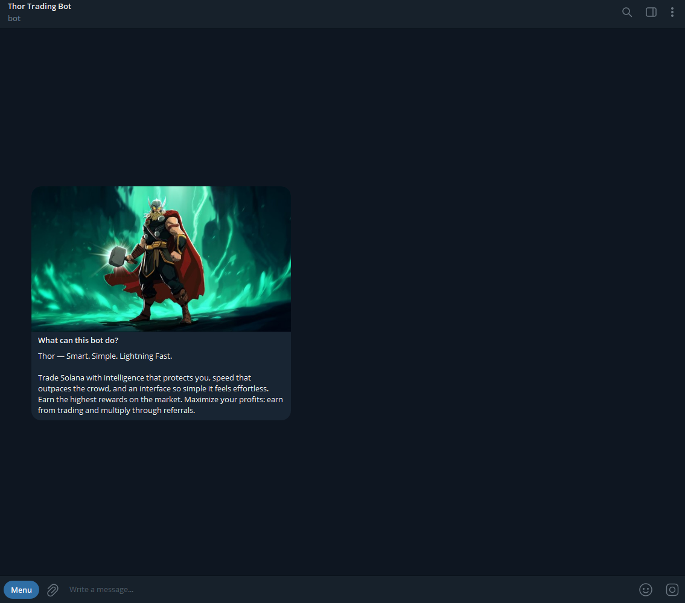

# Activation

### **Step 1: Launch the Bot**

Open Thor @ThorSolana\_bot Bot via the official link or through Telegram. Click on or type in `/start` to run Thor.

<figure><figcaption></figcaption></figure>

### **Step 2: Fund Your Wallet**

Once you start Thor, it will display your wallet address. To start using it:

* **Send SOL** to this address.
* As soon as the deposit is confirmed on-chain, you'll be ready to trade.\
  You can view your balance anytime within the bot.

<figure><figcaption></figcaption></figure>

***

### **How to Find a Token with Thor**

Thor makes it easy and flexible to locate the token you want to trade. You can use several simple methods:

1. **Paste a Contract Address (CA)**\
   Paste a token’s contract address directly into the chat. Thor will automatically recognize it and immediately display the token details.
2. **Forward a Buy Bot Message**\
   Forward any message from another buy bot. Thor will detect the contract address within the message and automatically load the token information.
3. **Share a PumpFun or DexScreener Link**\
   Paste a link to a token from trusted platforms such as PumpFun or DexScreener. Thor will detect the token and show a preview with the relevant details.
4. **Type the Token Symbol**\
   If you don’t have the contract address, simply type the token’s symbol. Thor will search and display the most relevant matching tokens.
