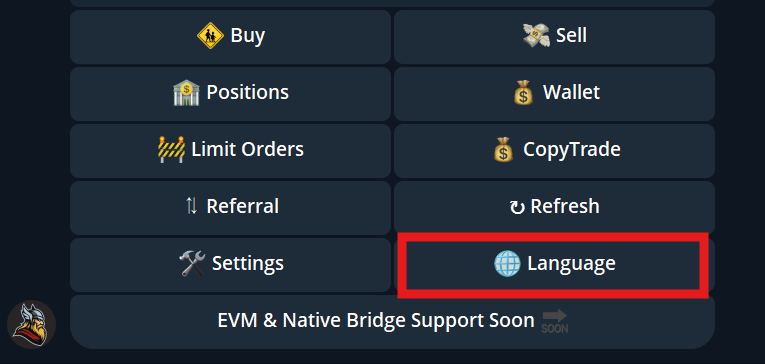
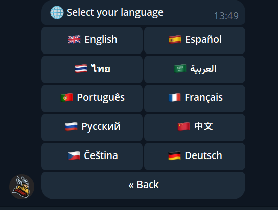

# Global Language Support

**Available languages:**\
🇬🇧 English\
🇷🇺 Russian\
🇩🇪 German\
🇪🇸 Spanish\
🇨🇳 Chinese\
🇹🇭 Thai\
🇨🇿 Czech\
🇫🇷 French\
🇵🇹 Portuguese\
🇸🇦 Arabic

Switch your preferred language in seconds and trade comfortably with **real-time updates, commands, and insights in your own language** — no translation needed.

Type `/START` and press on LANGUAGE to choose your preferred language for the bot.

<figure><figcaption></figcaption></figure>

Choose on of the current 10 language available by pressing on the one you prefer:

\

This update is part of our ongoing mission to make **Thor the most accessible, trader-first bot in crypto**, connecting Odin Tools users worldwide under one hammer. ⚡️
