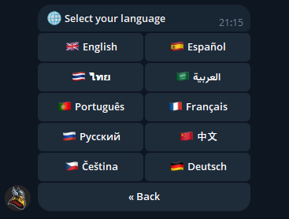

# Global Language Support

To make the experience seamless for every trader across the world, Thor now supports 10 languages across the interface and key bot interactions.

**Available languages:**\
🇬🇧 English\
🇷🇺 Russian\
🇩🇪 German\
🇪🇸 Spanish\
🇨🇳 Chinese\
🇹🇭 Thai\
🇨🇿 Czech\
🇫🇷 French\
🇵🇹 Portuguese\
🇸🇦 Arabic

Switch your preferred language in seconds and trade comfortably with **real-time updates, commands, and insights in your own language** — no translation needed.

***

### Tutorial

* Press on LANGUAGE to choose your preferred language for the bot.

<figure><figcaption></figcaption></figure>

* Choose on of the current 10 language available by pressing on the one you prefer:\
  \
  
