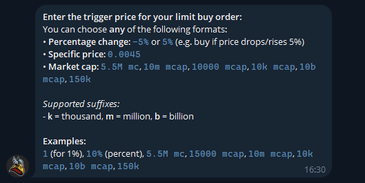

# Limit Orders

### What are limit orders?&#x20;

Limit orders lets you automatically buy when your target price hits — perfect for catching dips without watching charts all day.

***

### How to Set It Up

1. **Open Thor Bot** on Telegram.
2. Enter the **token contract address (forward or drop the ticker)**
3. When the trade panel appears, select **BUY WHEN**.

<figure><figcaption></figcaption></figure>

* Choose how much **SOL** to spend or enter a custom amount.
* Set your **target price** by pressing **Set Trigger Pric**

<figure><figcaption></figcaption></figure>

#### Setting Your Trigger Price

When creating a **Limit Buy** order, you can tell Thor **when** to buy using any of these formats:

**Options:**

**Percentage change:**

`-5%` → buy if price drops 5%

`5%` → buy if price rises 5%

**Exact price:**

`0.0045` → buy when price hits 0.0045

**Market cap target:**

`5.5M mc` → buy when market cap hits 5.5 million

`10k mcap` → buy at 10,000 market cap

**Supported suffixes:**

`k` = thousand

`m` = million

`b` = billion

**Examples:** `1%`, `10%`, `5.5M mc`, `15000 mcap`, `10m mcap`, `10k mcap`, `10b mcap`, `150k`

<figure><figcaption></figcaption></figure>

Choose how long the order should stay active by pressing Expiration. Enter expiration\
(m = minute, h = hour, d = day, w = week): Examples: 15m, 5h, 2d, 1w**1 hour**, **24 hours**, or **3 days**.

Tap **Create Order** — your limit-order is active now!

<figure><figcaption></figcaption></figure>

***

You can view all the active limit orders by pressing **/Start** and then press on **Limit Orders. Here you can create or remove any buy/sell orders.**

<figure><figcaption></figcaption></figure>

**Tip:** Combine Limit Buy with Thor’s **Auto Sell** or **Trailing Stop-Loss** to fully automate your entry and exit strategy.
