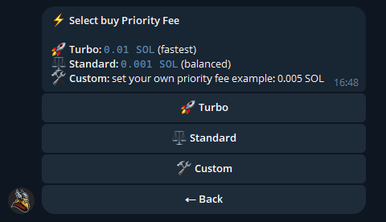

# Priority Fee Setup

To stay competitive in fast-moving markets, Thor allows you to set a **priority fee** for your transactions.

***

### **What is a Priority Fee?**

A priority fee is an additional fee paid to validators that helps your transaction get processed faster. This can be important during periods of high network activity.

With a priority fee, your transaction is more likely to:

* Be confirmed more quickly
* Be processed before competing transactions

***

### **How to Set a Priority Fee**

1. Open **Settings**

<figure><figcaption></figcaption></figure>

2. Choose whether you want to adjust the **Buy Priority Fee** or **Sell Priority Fee**

<figure><figcaption></figcaption></figure>

3. Select one of the preset options or enter a **custom fee value**

<figure><figcaption></figcaption></figure>

Once set, Thor will automatically include the priority fee with your transactions to help ensure faster execution.
