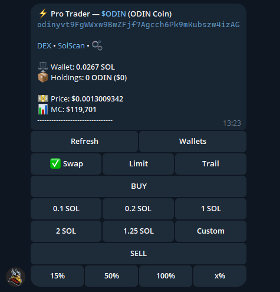

# Pro Trader Mode

Pro Trader is a combined Buy + Sell interface designed for fast, one-tap trading — everything you need in a single view.

***

### Why Use Pro Trader?

Speed is everything in memecoin trading. Pro Trader removes every unnecessary step between you and execution — no confirmation popups, no wasted seconds. Whether you're scaling in, taking partials, or cutting a loss, everything happens in one tap from one screen.

***

### What You Get

| Feature           | Details                                                  |
| ----------------- | -------------------------------------------------------- |
| Unified interface | Buy and Sell in one screen                               |
| One-tap execution | No confirmation step — trades fire instantly             |
| Shared slippage   | One setting applies to both Buy and Sell                 |
| Limit orders      | Set buy and sell limits from the same screen             |
| Trailing stops    | Available directly in the Sell section                   |
| Wallet management | Switch wallets or deposit SOL without leaving the screen |

***

### How to Enable

1. Open Thor Trading Bot

<figure><figcaption></figcaption></figure>

2. Go to **Settings → Trading Settings**

<figure><figcaption></figcaption></figure>

3. Toggle **Pro Trader** on

<figure><figcaption></figcaption></figure>

Once enabled, the Pro Trader view loads automatically whenever you navigate to a token.

***

### How to Trade

**Buying** Tap any preset amount — **0.1 SOL, 0.2 SOL, 1 SOL, 2 SOL, 1.25 SOL** — or use **Custom** to enter your own. (Note: Entering a custom amount will trigger the buy instantly — no additional confirmation needed).

**Selling** Tap a sell percentage — **15%, 50%, 100%** — or use **x%** to enter a custom amount.

**Limit & Trailing** Switch between **Swap**, **Limit**, and **Trail** at the top of the interface to access advanced order types.

<figure><figcaption></figcaption></figure>

***

### Wallet Management

Tap **Wallets** at the top of the screen to:

* Switch between your connected wallets instantly
* Deposit SOL directly without navigating away

Your current wallet balance and holdings are always visible at the top of the Pro Trader view.
