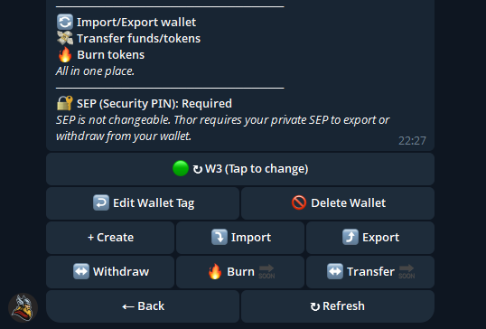

# Wallet Management

Thor allows you to operate multiple wallets effortlessly, making it ideal for multi-strategy trading, asset segregation, and efficient portfolio management, while maintaining full control and flexibility over each wallet.

***

### **Maximum Wallets**

You can generate **up to 10 wallets** within the bot. Each wallet functions independently and can be:

* Funded separately
* Used to execute trades
* Switched between instantly

***

### **Switching Wallets**

To switch wallets:

1. Use the `/wallet` command or tap the wallet menu.
2. Select the wallet you want to activate.

<figure><figcaption></figcaption></figure>

***

### **Export & Withdraw Anytime**

You're in full control. You can:

* **Export** your private keys
* **Withdraw funds** to any external wallet
* Manage your assets without restriction

Thor is non-custodial — **you always own your keys.**
