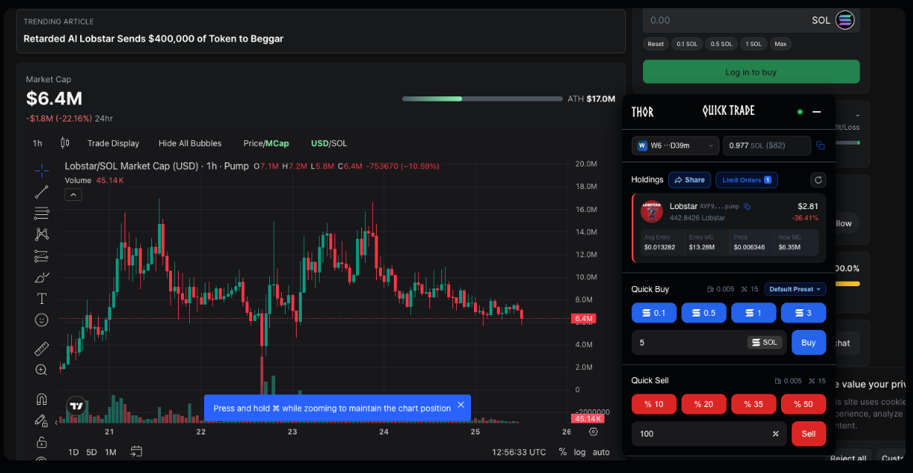

# Thor - Web Extension

<figure><figcaption></figcaption></figure>

#### How It Works

The Thor Extension integrates Telegram trading straight into your web terminal, blending speed, automation, and flexibility into one smooth process. You continue with your favorite terminal, boosted by Thor’s execution engine and features.

Thor enhances your current terminal without replacing it, offering quicker executions, more customization options, effortless mobile trading, and strong automation in a single, unified setup.

***

#### **What You Get**

**Unified Trading**

* Embed Telegram trading power directly into your terminal.
* No need to switch between Telegram, charts, or other apps like DexScreener and Pump.fun.

**Instant Execution**

* One-click trades for quick buys and sells.
* Sell all holdings in a single action.

**Quick Control**

* Execute trades without leaving the terminal.
* Switch strategies fast using customizable presets.
* Trade with one or multiple wallets easily.

**Advanced Features**

* Set slippage, priority fees, and expirations for precision.
* Create limit orders with triggers like percentage, market cap, or price.
* Add trailing stops for automated protection.

\
\
 
