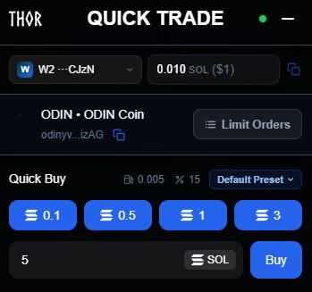

# Activation

### Activation Steps



Click on Get Code.

<figure><figcaption></figcaption></figure>




You’ll be redirected to Thor on Telegram, where your activation code is sent. Never share this code.

<figure><figcaption></figcaption></figure>




Copy and paste the code into the extension.

<figure><figcaption></figcaption></figure>




Click Verify.

<figure><figcaption></figcaption></figure>




The extension refreshes and activates.

<figure><figcaption></figcaption></figure>




Open a chart and Thor will be ready.

<figure><figcaption></figcaption></figure>



