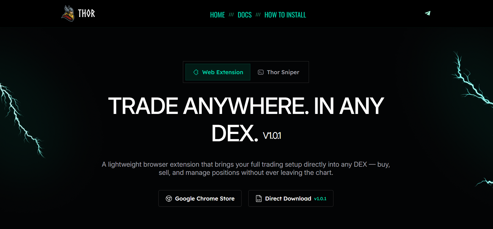

# Download


Important Note\
\
<mark style="color:$danger;">Always ensure you are using the official Thor Extension. We are not responsible for unofficial, modified, or impersonated versions.</mark>

We know that browser extensions can be sensitive, especially in crypto environments. The Thor Extension is reviewed and approved through the official browser store and only adds Thor trading actions (such as Buy and Sell) to supported trading terminals.

Thor will never request private keys, wallet access, or transaction approvals. The extension does not store, track, or transmit any user data.


***

You can download the Thor Extension either from the Chrome Web Store or as a .zip file directly from our [website](https://odin.tools/thor/extension) linked below.



<figure><figcaption></figcaption></figure>
