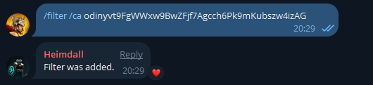

# Add/remove filters

#### ➕ How to set-up filters

Easily access contract addresses, links, and information.

Tutorial: Type `/filter word` text in your group and press Enter. Heimdall will confirm if the filter has been set. How it works: You or group members can type the filtered word to trigger the input text. Heimdall will send the text instantly in the group.  &#x20;

<figure><figcaption></figcaption></figure>

Use these commands to remove the filers:

`/removefilter word` – Remove a filter
\
`/removeallfilters` – Remove all filters
