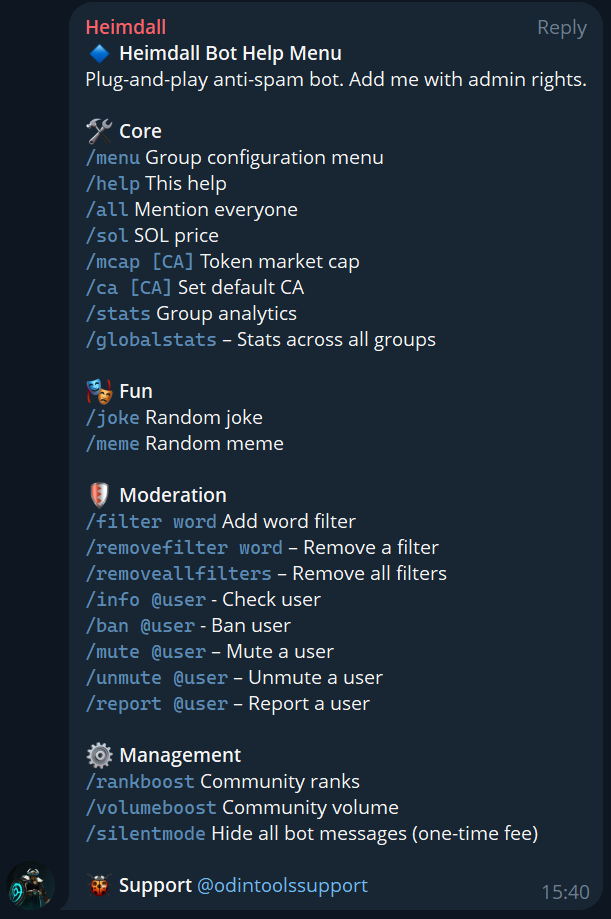

# Heimdall set-up

#### ⚙️ How to Add Heimdall to Your Telegram Group

Adding Heimdall `(@heimdall_odintools_bot)` to your Telegram community takes less than a minute. Once active, it automatically protects your group from spam, scams, and malicious users — and connects you to the global Heimdall protection network.

#### 🪶 Step-by-Step Setup

1. **Invite Heimdall Bot**
   * Open the official **Heimdall Bot** link: t.me/`heimdall_odintools_bot`
   * Click **“Add to Group”** and choose your Telegram community.
2. **Grant Admin Permissions**\
   Heimdall needs admin rights to ban, mute, and delete malicious messages.\
   Make sure the following permissions are **enabled**:
   * Delete messages
   * Ban users
   * Restrict users
   * Pin messages (optional)
3. **Confirm Activation**\
   Once added, Heimdall will send a confirmation message in your group showing it’s active and synced with the global network.
4. **Done. You’re Protected.**\
   That’s it — your group is now part of the **Heimdall Guardian Network**.\
   From this point, any spammer banned anywhere in the network will automatically be banned in your group too.

**Tutorial Video:** [Watch here](https://www.youtube.com/watch?v=r_ipw5Rp7Zc)

#### 🛡️ Optional Settings

* `/help` – See all the options
* `/settings` – View and adjust moderation preferences.
* `/stats` – See your group’s protection data.
* `/info @username` - View user ID, recent suspicious messages, and status.

***

#### See the full list of Heimdall commands:

<figure><figcaption></figcaption></figure>

#### 💡 Pro Tip

Adding Heimdall early to your community helps prevent infiltration before your project grows. Every new group strengthens the overall shield — so when you protect your chat, you help protect thousands of others.

> Heimdall stands watch over the bridge.\
> No spam. No scams. Just signal. ⚡
