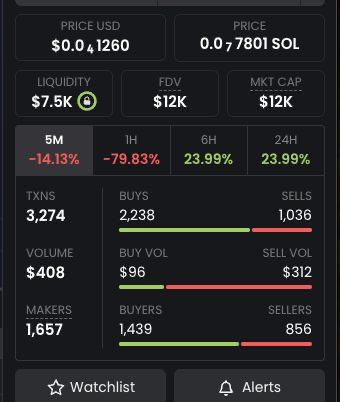

# Rank Bot

**Command:** `/rank_bot`

### What is Rank Bot?

The **Rank Bot** is designed to simulate trading activity by performing multiple small amount transactions from multiple wallets. Bot is designed to generate Makers and Transactions for your coin.&#x20;

***

### Available Pools



<strong><code>PumpSwap, Raydium AMM, Raydium CPMM, Raydium CLMM, Raydium Launchpad, Meteora DLMM, DYN, DLMM2</code></strong>



***


**Minimum deposit is 1.5 SOL for first deposit, 1 SOL will be charged for whitelisting the CA for User. Then bot is free from services fees. Recharge as much as you want and run as much as you want!**


***


Highest speed is 1s and bot is able to generate 1600 Makers and 3200 Transactions every 5 minute.&#x20;



***

### ⚙️ Available Controls



**Start / Stop**

Start the bot manually. Stop it anytime when not needed, and **resume it instantly** when you're ready again.



**Speed**

* Control how fast the bot sends transactions.
* Higher speed = faster transaction but faster balance consumption.
* Lower speed = more natural, slower burn.



**Execution Mode**

**NEW: Random Execution Mode hides bot patterns by performing randomized trades.**

You can also define custom buy/sell ratios (e.g. 1:1, 3:2, 5:1).



<figure><figcaption>
Command /rank_bot, Rank Bot Screen
</figcaption></figure> <figure><figcaption></figcaption></figure>

### ✅ Bot Checklist:

1. Set your **Token Contract Address**
2. Deposit at least **1.5 SOL** to your **Asgard Wallet (Bot Wallet). ONLY DEPOSIT SOLANA**&#x20;
3. Start the bot

