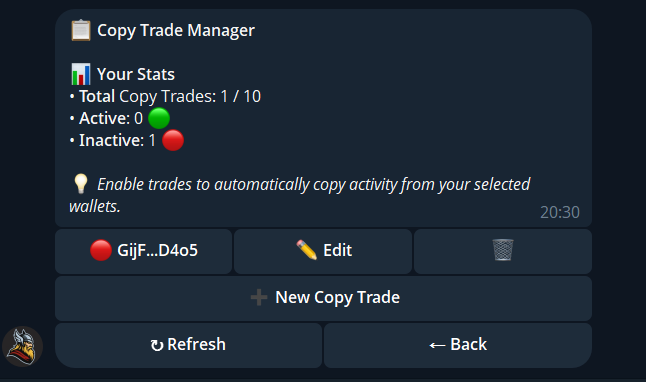
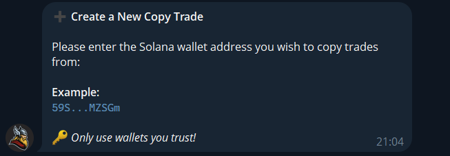
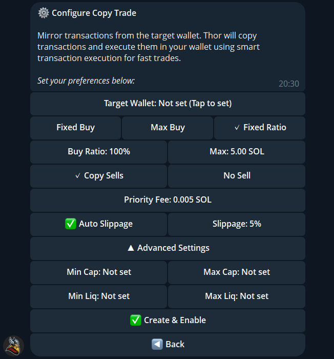

# Copy trade

⚠️ Please note that if you frequently copy the wallet and its transactions, your SOL balance may be consumed quickly. If you don’t have high requirements for copy trade speed, it’s recommended to enable **auto slippage** and set a lower **gas priority fee** (for example, **0.002–0.006 SOL**). Many users make profits from copy trading, but their gas priority fees are too high, causing them to lose money in the end.

One copytrade transaction= buying/selling amount + Gas priority fee + 0.9% Thor handling fee

* Copy Trade instructions
* Copy Trade Settings
* Wallet Copy Trade steps

### Copy Trade instructions:

* By setting up the copy trading, you can easily replicate the trades of any wallet on Solana and earn profits when they do.
* Currently, the Copy Trade supports automatic copy wallets‘ buying, selling. The feature to sell at take profit and stop loss will be added soon.
* You are allowed to create a maximum of **10** wallet copy tasks
* Currently, only the SOL chain supports wallet copying, and users who have logged in to TG can use the wallet copying function.

### **Copy Trade Settings:** 

1. **Single copy buying method**
   * **Fixed buy** : Regardless of the purchase amount of the copy address, purchase is made according to the fixed purchase quantity
   * **Maximum follow-buy** : If the purchase amount of the copy address is less than the set maximum purchase amount, the purchase amount will be based on the purchase amount of the copy address. If the purchase amount of the copy address exceeds the set maximum purchase amount, the purchase will be based on the set maximum volume.
2. **Selling method**
   * **Automatic follow-up selling:** When the copy address sells coins, it will be sold in proportion to the proportion of its position (only the tokens bought by the copy trade will be sold).\
     For example: the user chooses to copy address A. When address A sells 10% of its own position, the user's follow-up buy will be sold in proportion to 10% (the user's own bought coins or the coins bought by other copy addresses will not be sold)
   * **No follow-up selling:** The system does not automatically sell coins, you need to sell manually
3. **Set copy trading parameters** : Priority fee, Slippage
4. **Advanced copy order settings:**
   * **Market Cap limit:** You can set the market cap limit when buying tokens
     * For example, if you set the minimum market cap to 50,000, the purchase will only be executed when the token market cap is higher than 50,000 USD.
     * For example, if you set the maximum market cap to 100,000, the purchase will only be executed when the token market cap is less than 100,000 USD.
   * **Minimum copy amount:** You can set the minimum copy amount for the target address. Only when the purchase amount of the copy address is greater than the minimum copy amount, the copy purchase will be carried out.
     * For example, if the minimum copy amount is set to 0.5 SOL, the purchase will be executed only when the target address buys more than or equal to 0.5 SOL.
   * **Maximum copy amount:** You can set the maximum copy amount for the target address. Only when the purchase amount of the copy address is less than or equal to the maximum copy amount, the copy purchase will be carried out. Prevent the target address to buy large amounts of coins to pull up the price then rug pull
     * For example, if the maximum copy amount is set to 10 SOL, when the target address purchase is greater than 10 SOL, no purchase will be made

### Notice: 

* If copy trade order failed or copy bought is missed, please check whether the copy trade filtering with advanced settings has been enabled
* If copy **Buy/Sell Fails** (for example: the slippage, low SOL balance, network congestion, timeout, or low priority fee). Buy/sell will be retried 1\~3 times depending on the error type, the system will not retry the purchase/selling, you should buy/sell the token manually

### &#x20;Thor Wallet Copy Trade 

1\) Create New Copy Task:

<figure><figcaption></figcaption></figure>

2\) Enter the wallet address you want to copy trade from

<figure><figcaption></figcaption></figure>

3\) Set up

<figure><figcaption></figcaption></figure>
