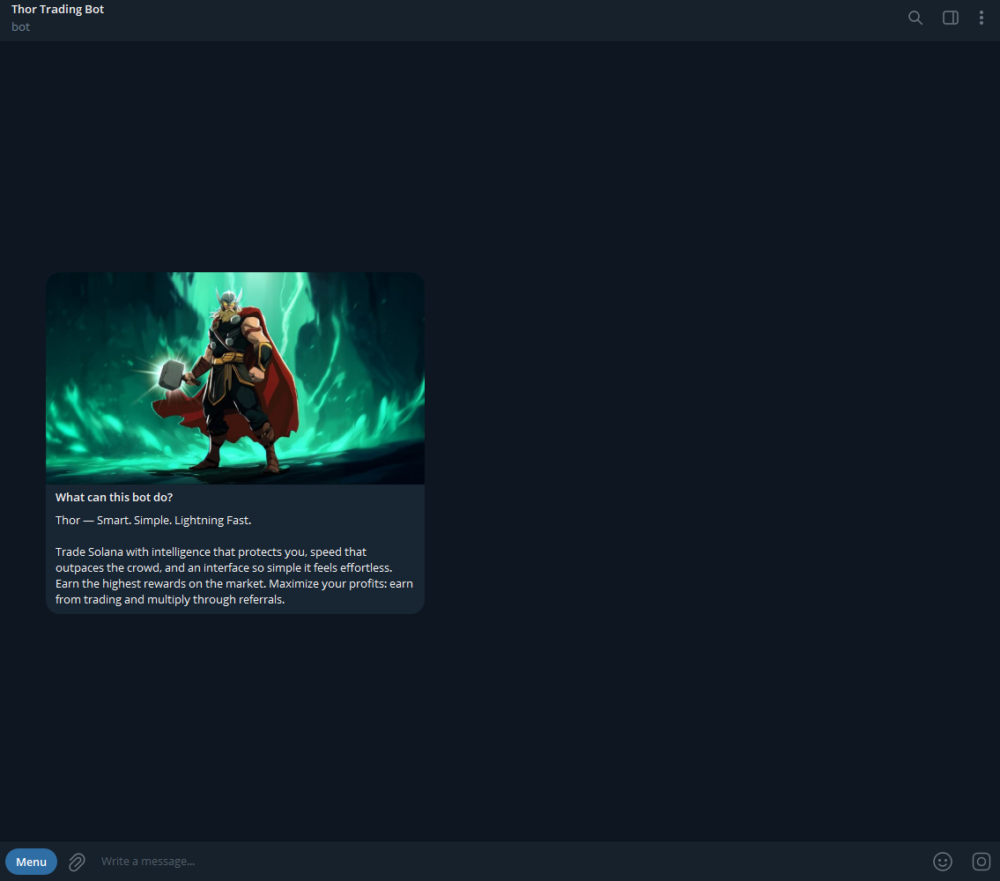

# Getting started with Thor

**Step 1: Launch the Bot**\
\
Open Thor @ThorSolana\_bot Bot via the official link or through Telegram. Click on or type in `/start` to run Thor.

<figure><figcaption></figcaption></figure>

\
**Step 2: Fund Your Wallet**

Once you start Thor, it will display your wallet address. To start using it:

* **Send SOL** to this address.
*   As soon as the deposit is confirmed on-chain, you'll be ready to trade.\
    You can view your balance anytime within the bot. 

    <figure><figcaption></figcaption></figure>

\
Thor makes it super flexible to locate the token you want to buy. Here’s how:

**Send a Contract Address (CA)**\
Just paste the contract address into the chat. Thor will recognize it and show the coin details instantly.

**Forward a BuyBot Message**\
Forward any message from another buy bot, and Thor will parse the CA and pull up the coin data.

**Share PumpFun or DexScreener Link**\
Paste a coin's link from trusted sources like PumpFun or DexScreener. Thor will auto-detect and give you the token preview.

**Type the Symbol**\
Not sure of the CA? Just type the token's symbol name, and Thor will search the most relevant tokens for you.

**🚨 Airdrop Scam Detection**\
Any **coins you haven’t actually bought** will now be **marked with a warning**. These tokens will show:

* ⚠️ **Airdrop Scam** label
* ❌ **No PnL, no average entry, no market cap** data

**🛡️ Thor also has a Buy Protection**\
When enabled, **Thor will automatically use your full available balance** if you don’t have enough SOL for the intended purchase.

> Example: You try to buy with **1 SOL** but only have **0.8 SOL** — Thor will buy with **0.8 SOL** instead of failing the order.

**💵 Dollar-Based Buying**\
You can now **use USD value ($)** as your buy quote. Customize your buy buttons to trade using dollar amounts instead of SOL.

* Adjust under **Settings → Buy Layout** or by editing your **buy button quote**.
* Works seamlessly with **Autobuy**, **Limit Orders**, and all standard buy functions.

**💎 Streamlined Stablecoin Display**\
Stablecoins like **USDT and USDC** are now shown in a **short, clear format** for better readability:

> Example: **1000 USDT (1000 $)** — with quick access to **Sell**, **Buy**, and **Transfer** options.&#x20;


Buy & Sell Tutorial: [https://youtube.com/shorts/3Z3tQg9hoaY](https://youtube.com/shorts/3Z3tQg9hoaY)

