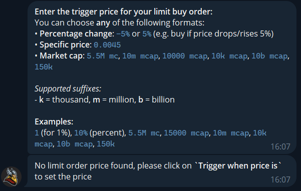

# Limit Order

#### How to Set It Up

1. **Open Thor Bot** on Telegram.
2. Enter the **token contract address (forward or drop the ticker)**
3. When the trade panel appears, select **BUY WHEN**.

<figure><figcaption></figcaption></figure>

* Choose how much **SOL** to spend or enter a custom amount.
* Set your **target price**  by pressing **Set Trigger Price**

<figure><figcaption></figcaption></figure>

#### Setting Your Trigger Price

When creating a **Limit Buy** order, you can tell Thor **when** to buy using any of these formats:

**Options:**

* **Percentage change:**
  * `-5%` → buy if price drops 5%
  * `5%` → buy if price rises 5%
* **Exact price:**
  * `0.0045` → buy when price hits 0.0045
* **Market cap target:**
  * `5.5M mc` → buy when market cap hits 5.5 million
  * `10k mcap` → buy at 10,000 market cap

**Supported suffixes:**

* `k` = thousand
* `m` = million
* `b` = billion

**💡 Examples:** `1%`, `10%`, `5.5M mc`, `15000 mcap`, `10m mcap`, `10k mcap`, `10b mcap`, `150k`

<figure><figcaption></figcaption></figure>

Choose how long the order should stay active by pressing Expiration. Enter expiration (m = minute, h = hour, d = day, w = week): Examples: 15m, 5h, 2d, 1w**1 hour**, **24 hours**, or **3 days**.

✅ Tap **Create Order** — your **auto-buy (Buy the Dip)** order is now live!

<figure><figcaption></figcaption></figure>

***

You can view all the active limit orders by pressing **/Start** and then press on **Limit Orders. Here you can create or remove any buy/sell orders.**

<figure><figcaption></figcaption></figure>

**Pro Tip:** Combine Limit Buy with Thor’s **Auto Sell** or **Trailing Stop-Loss** to fully automate your entry and exit strategy.
