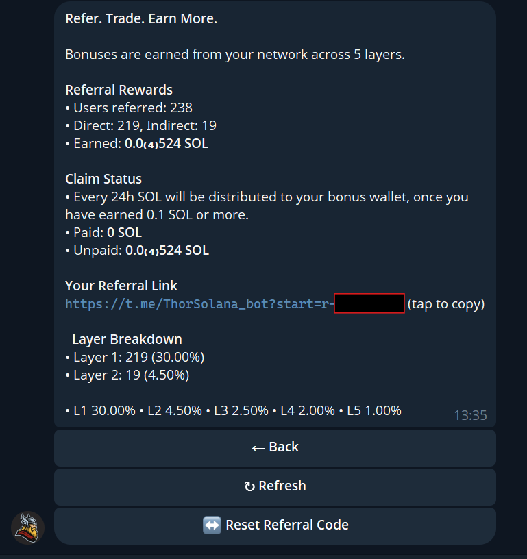

# Trading Fees & Cashback Tiers & Rewards

#### 💸 Trading Fee & Cashback Tiers

Thor charges a **1% fee per trade**, but loyal users can get up to **50% cashback** based on trading volume.

**🎖 Cashback Tiers:**

| Tier        | Required Volume | Cashback Reward |
| ----------- | --------------- | --------------- |
| 🥉 Bronze   | Default         | 0%              |
| 🥈 Silver   | ≥ $10,000       | 20% Cashback    |
| 🏅 Gold     | ≥ $100,000      | 30% Cashback    |
| 💎 Diamond  | ≥ $1,000,000    | 40% Cashback    |
| 👑 Platinum | ≥ $10,000,000   | 50% Cashback    |

Earn higher rewards as your trading volume increases — Thor gives back to its strongest warriors.

***

**🪙 How It Works**

* Cashback is calculated monthly. You can view you tier by going to <kbd>/START</kbd>
* You’ll receive it directly to your wallet balance.
* Tier status is automatically upgraded when volume thresholds are hit.

**We also offer a 5-layer rewards system - THE BEST in the market! 🤑**

**Thor reward layers:**&#x20;

* **Layer 1: 30%**
* **Layer 2: 4.5%**
* **Layer 3: 2.5%**
* **Layer 4: 2%**
* **Layer 5: 1%**

Type <kbd>/REFERRAL</kbd>to create a referral link and share it with your network.\
On this page, you can view your personal referral link and all available options.\
It will display all the data about people who joined through your personal link,  including those who joined through them, up to 5 levels deep.\
You’ll also be able to see the amount of SOL you’ve earned as a reward.

<figure><figcaption></figcaption></figure>

That means you earn when your referral trades and also when their referrals trade. It keeps building.

The setup is built to scale and grow your income.

<figure><figcaption></figcaption></figure>

