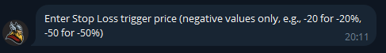

# Trailing Stop-Loss

### 1. How Trailing Stop-Loss Works

A **Trailing Stop-Loss** is an upgraded version of a standard stop-loss.\
It automatically **moves upward as the token price rises**, locking in gains and reducing downside risk — perfect for catching momentum without getting rugged by pullbacks.

#### Example

You set:

* Take Profit: **+200%**
* Stop Loss: **-40%**\
  \
  Tutorial:\
   (1).png>)\
  .png>)\
  .png>)\
  

If the token pumps +190% and then dips:

* **Without Trailing Stop:** Your position won’t sell until it drops all the way to -40%, turning profit into loss.
* **With Trailing Stop ON:** The stop price automatically rises as the token climbs. When price hits +190%, your stop adjusts upward — locking your minimum gain around **+74%** instead of letting it fall into the red.

**Formula:**

> Stop Price = Highest Price × (1 - Drawdown %)

So if the token peaks at +190% with a 40% drawdown:

> Stop Price = 190% × (1 - 0.4) = +74%

That means your trade exits in profit — automatically. ⚔️

***

### 2. Key Notes When Using Trailing Stop-Loss

* The **stop price only moves upward** — it never moves down. As long as price keeps climbing, your protection climbs with it.
* There’s **no activation threshold** — the trailing function starts as soon as you open the order.
* **Trailing Stop-Loss** does **not** affect your take-profit target. If both are enabled, the two levels move independently.
* When both trailing take-profit and trailing stop are active, the system will close your position when price falls by the smaller of the two drawdown values.

***

### 3. Trailing Stop-Loss Properties

| Feature           | **Trailing Stop-Loss**                 |   |
| ----------------- | -------------------------------------- | - |
| **Goal**          | Limit downside, secure profit floor    |   |
| **Trigger Price** | None (starts immediately)              |   |
| **Use Case**      | Protect your capital in volatile moves |   |
|                   |                                        |   |

***

**Pro Tip:**\
Pair Thor’s **Trailing Stop-Loss** with **Auto Sell** to automate your exits — no more staring at charts or missing tops.
