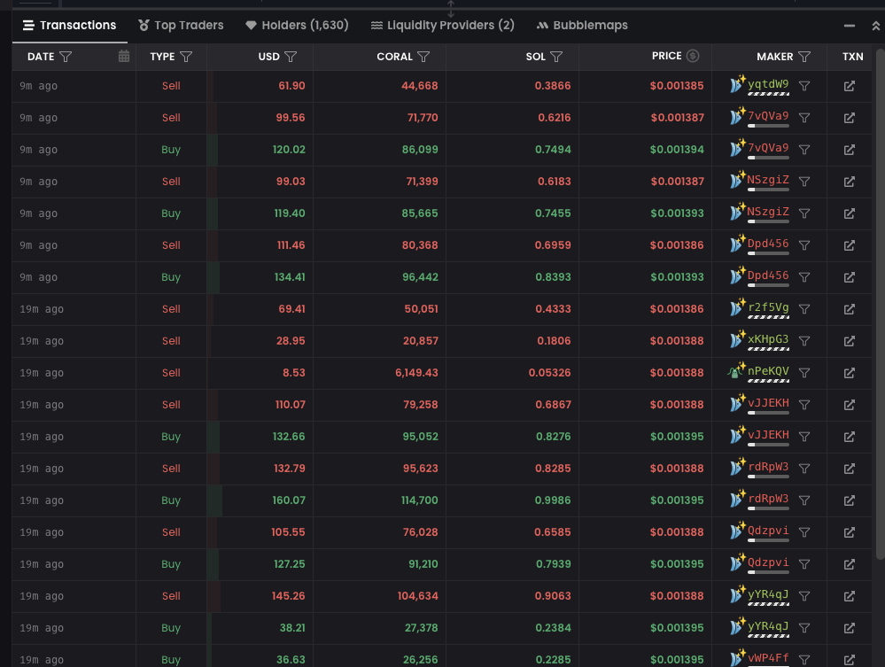

# Volume Bot

**Command:** `/volume_bot`

### What is Volume Bot?

The **Volume Bot** is designed to simulate trading activity by performing multiple **linked buy/sell transactions** across many wallets. It’s built to be **cheap, fast, and highly effective**.

***

### Available Pools



<strong><code>PumpSwap, Raydium AMM, Raydium CPMM, Raydium CLMM, Raydium Launchpad, Meteora DLMM, DYN, DLMM2</code></strong>



***


**Minimum deposit is 1.5 SOL for first deposit, 1 SOL will be charged for whitelisting the CA for User. Then bot is free from services fees. Recharge as much as you want and run as much as you want!**


***

### ⚙️ Available Controls



**Start / Stop**

Start the bot manually. Stop it anytime when not needed, and **resume it instantly** when you're ready again.



**Speed**

* Control how fast the bot sends transactions.
* Higher speed = more volume but faster balance consumption.
* Lower speed = more natural, slower burn.



**Execution Mode**

**NEW: Random Execution Mode hides bot patterns by performing randomized trades.**

You can also define custom buy/sell ratios (e.g. 1:1, 3:2, 5:1).



**Calculate Volume**

Use the built-in calculator to estimate the **approximate volume** your deposit will generate — based on the current pool and SOL price.



<figure><figcaption>
Command /volume_bot, Volume Bot Screen
</figcaption></figure> <figure><figcaption></figcaption></figure>

### ✅ Bot Checklist:

1. Set your **Token Contract Address**
2. Deposit at least **1.5 SOL** to your **Asgard Wallet (Bot Wallet). ONLY DEPOSIT SOLANA**&#x20;
3. Start the bot using `/volume_bot`

